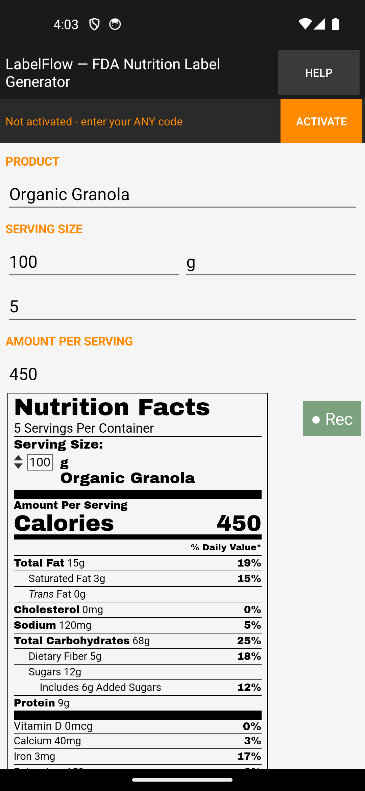
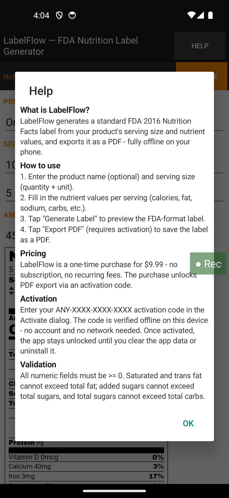
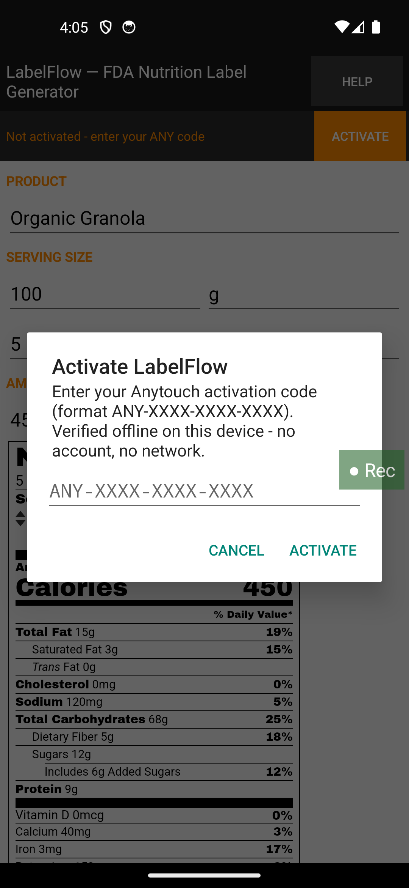
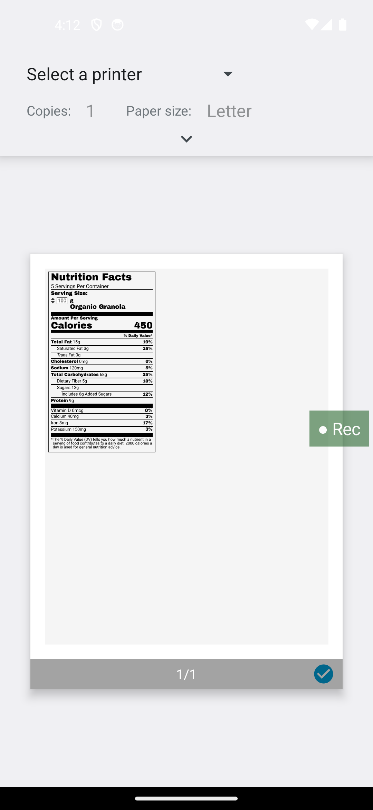

# LabelFlow — FDA Nutrition Facts Label Generator for Android

**Type serving size and nutrition values, get a standards-compliant **FDA 2016** Nutrition Facts label, export it as a PDF. Fully offline, no account, no backend, **zero permissions**.**

LabelFlow is a small, focused Android utility built for people who need a correct US Nutrition Facts label fast — food makers preparing a package mockup, developers prototyping product pages, students and hobbyists learning label anatomy.

> **Repository status.** This repository publishes the **v0.1.7 demonstration artifact** (APK) for evaluation and portfolio reference. The current commercial version (v0.2.0) is sold directly via [Gumroad](https://gumroad.com) as a one-time purchase; its source is not published here. Every capability claim below is what the app actually does on a real device — no store-listing hype, no fabricated screenshots.

## What it does

- **FDA 2016 Nutrition Facts label** — renders the classic left-aligned "2.0" label (serving size, calories, the bolded macro block, %DV column, footnote), based on the well-known `nutritionix/nutrition-label` engine (MIT), shipped fully inside the app.
- **Form → label → PDF, all offline.** Fill serving size (amount + unit) and the nutrition fields; preview the label on screen; export a letter-size PDF through the system print dialog.
- **Built-in consistency checks** the form enforces before rendering: saturated/trans fat ≤ total fat, added sugars ≤ total sugar, total sugar ≤ total carbohydrate.
- **Watermarked preview before activation** — you can see exactly what the output looks like before buying; your own data is rendered only after activation.
- **Honest activation, on-device.** A one-time $9.99 purchase unlocks the app via a local code check (HMAC short-signature, see below). No subscription, no server, no account.

## Screenshots

| Launch | Help | Activation | Export |
|---|---|---|---|
|  |  |  |  |

*(Screenshots from the current build; the v0.1.7 APK in this repo has the same UI.)*

## Install

1. Download `LabelFlow-0.1.7.apk` from the [latest release](https://github.com/kinsin818/LabelFlow/releases).
2. Copy it to an Android phone (Android 8.0+), tap it, and allow "install from unknown apps" when your ROM asks.
3. Launch and explore — the preview area shows a watermarked sample label before activation.

**Note:** there is no Play Store listing; the app is distributed directly. The APK in this repo is the **v0.1.7 demonstration build** — it ships without the evaluation demo codes, so the activation dialog expects a purchased code. The current version (v0.2.0, R8-obfuscated) is what customers receive from Gumroad.

## Activation & the honor system (straight talk)

LabelFlow is a paid app ($9.99 one-time, no subscription). The unlock key is a locally-verified 18-character code (`ANY-XXXX-XXXX-XXXX`): 7 free body characters + a 5-character HMAC-SHA256 short signature over a fixed built-in key, with a fail-closed on-device check (5 wrong attempts → 10-minute lockout, in-memory only).

We are honest about what this is: it stops casual wrong guessing, it does **not** stop someone determined to reverse-engineer the app — no fully-offline software can. We keep the price low and ask you to play fair. The evaluation demo codes are deliberately **not** published in this public build.

## Privacy

- The app declares **no `INTERNET` permission** — it cannot connect to any network or server.
- Nothing you type is collected, uploaded or shared.
- The only thing persisted is a small local "activated" flag (a 12-character verification body derived from your code); the raw code is not stored. Uninstalling removes everything.

## Building / provenance

- Version lineage and release hashes are maintained in the publisher's release ledger (SHA-256 pinning per artifact); the v0.1.7 APK here is hash-locked to that ledger.
- `v0.1.7` = fifth-round review closure: buyer upgrade note, render-ack gating + `JSONObject.quote` escaping, lint baseline, privacy wording.

## License

Evaluation license — see [LICENSE](LICENSE). The APK in this repository may be downloaded, installed and evaluated for personal use; **commercial redistribution or repackaging is not permitted**. The commercial product is sold separately via Gumroad. Label rendering uses the MIT-licensed `nutritionix/nutrition-label` engine.

## Disclaimer

LabelFlow renders labels in the FDA 2016 format as a design aid. It is **not** a substitute for professional regulatory or legal review of food labeling, and it does not constitute a compliance opinion. Verify final artwork with an appropriate professional before printing.
